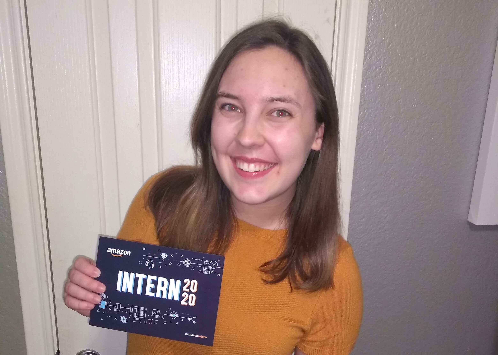

Over the past 12 weeks, I had the pleasure to return to my beloved Cryptography Tools team at Amazon for a second summer. Though this summer was remote, I still found myself personally contributing to the team’s mission in many ways and learning a lot along the way.

## The Job
Last summer, I came to the Crypto Tools team as an Amazon Future Engineers intern, and while I had extensive opportunities to learn about software development, security, cryptography, and working in a professional team, my project of building a secure random number generator did not have as much impact as a software development engineer’s (SDE) project would have (it was not secure or tested enough to be used in production, thank goodness). So, this year, as an SDE intern, I was excited to get to apply what I learned last year in a project that will highly impact the team’s operations.

My segment of the Crypto Tools team works on internal package management for cryptographic libraries across Amazon. They vend guidance on which are safe to use and which have security flaws and must be upgraded. When the team must push package consumers away from these deprecated packages, it’s helpful to see which consumers start and stop using a package and how many up- or downgraded to a different version over a given time period. This is where my project comes in. I built a command-line tool using Python Click that allows the engineer to see exactly that data for any owned package. This project also involves a back-end architecture made up of an S3 bucket and AWS Athena to store the data needed to do this analysis. This tool will help my team move consumers away from these packages and onto better ones faster than before, which leads to better customer experience all across Amazon.
## Leadership Principles
At Amazon, decisions are made through the lens of the [Leadership Principles](https://www.aboutamazon.com/working-at-amazon/our-leadership-principles), so that is the lens that I was asked to self-review my performance with.
#### Strengths
* Ownership
* Learn and Be Curious
* Dive Deep
#### Areas for Improvement
* Are Right, A Lot
* Have Backbone; Disagree and Commit
* Think Big

I won’t go into context for any of these things, but using these concrete categories was a great way to be constantly evaluating my own performance and decisions. What that link above says is really true: “Our Leadership Principles aren’t inspirational wall hangings.”
## The Culture of Documents
Amazon's work culture is heavily rooted in the use of documents to communicate information. This is a communication style that luckily works very well for me as someone who already puts a great deal of care into her words. Before even one line of code was written for my project, I had to write an extensive network of documents to convince other people on my team that the project has value. This includes a document describing the customer and their needs, a document describing how this project meets those needs, and a document describing the design of the project, in that order. This is how any Amazon engineer, not just interns, must propose a project. This is because Amazon believes in working backward from the customer to make sure all the work they do will bring some value to the customer. This wholesome desire to solve a customer’s problem is something for which I really respect Amazon. Writing data-driven documents that communicate ideas and recommendations is a great skill to cultivate even for situations outside of Amazon.
## Day in the Life
I spent the summer working remotely from my hometown of Austin, TX, but the majority of the team is in Seattle, WA, which is two hours behind. This lead to some confusion on the team at times, but we worked around it. Everyone on the team was cognizant of my team and would try to schedule meetings in times that work for both of us.

I would typically get up at 8 AM, roll over to my desk, and get two hours of uninterrupted work done. This was easily the most productive time of my day. At 10 AM, I would make breakfast and eat it with anyone in my family that happened to also be eating at that time. You’ll start to notice that **I refuse to work through meals unless there is something time-sensitive to work on**. After breakfast, I would sometimes have a 1:1, or I would get a small task done before our daily standup meeting. Standup meetings seem to be pretty common among technology teams: it’s a short daily meeting where you go over progress from the day before and what your goals are for the day ahead. Even though this meeting was at 11:45 AM for me, this tended to feel like the beginning of my “real” workday. Then, between 12 PM and 5–6 PM, I would be working on my goals for the day and bouncing around between meetings and 1:1s. Each day, I also block off an hour for lunch, and even though I didn’t tend to use the whole hour, it was nice to have a free hour during the day to do whatever I need to do. Then, at 6 PM at the latest, I consider my day over. I was often asked over the summer if I was encouraged to keep the same working hours as my team, and, as you can tell, that is not the case (as long as I wasn’t missing meetings).
## Meeting People
Unlike last year in Seattle, meeting coworkers and other Amazonians needed to be a purposeful gesture. During any given week, I might have 3–6 1:1s with Amazonians like my manager, my former manager, my mentor, anyone else on the team I want to catch up with, and Amazonians outside the team that I’m introduced to. My mentor was great about setting up 1:1s for me with people on teams doing ML in security contexts, which is a field I am very interested in. Before each 1:1, I always **prepare at least 5 questions for the other person**, not including the usual “what do you work on” questions. Also, something that my mentor told me that was super helpful is **always ask for resources in the other person’s field**. I got some really great video, blog, etc. recommendations from that question. If you want a 1:1 with someone that you don’t already have a mutual connection with, just make the meeting! The worst they can do is decline it. Or you might have a really great conversation.

As far as creating really great professional relationships is concerned, my advice would be to just show up, that’s always the first step. Show up to every happy hour chat, intern hangout, and team-wide meeting that you can. The relationships will start to form there.
## The Final Presentation
At the end of my internship, I had the opportunity to conduct a final presentation in front of the whole team about my project and why it’s valuable to the team and to Amazon. This was the single most nervewracking part of the internship because you have to do a 15–20-minute presentation and then take questions from engineers that have decades of experience on you. What I did to combat these nerves is a did a lot of **dry-runs with different segments of the audience and made sure to answer their questions, especially the ones I didn’t have an answer to, within the slides**. By the time the real presentation came around, I was so well-practiced and my slides were so fine-tuned that most of the questions were about how to use my project, not comprehension issues. The Q&A portion ended up being a really great conversation full of feedback about how to make my project more useful, all of which I documented for someone to come in later and implement.
## Post-Presentation Days
After my final presentation, I had 4 days before the last day of internship, so I asked for some extra work from the team. These tasks gave me really great visibility into what it’s like to work on this team full-time. It was also a great way to prove to myself that I’m qualified to be doing this type of work.
## Quality over Quantity
Something that I needed to improve on over the course of my internship was avoiding taking on so much extra work that I don’t have time to finish my goals that day/week/sprint. At one point, I was trying to do my internship, keep up with a Coursera course on Machine Learning, do a DeepRacer activity, do a hackathon, and not work on weekends. It was completely unsustainable. At a large company like Amazon, you are not expected to participate in every single event they create for interns, it’s impossible. Also, it’s important to realize that your internship work is designed to be full-time, so don’t feel like you have to do extra stuff to supplement. After realizing these things and letting some of these non-required events slip through the cracks, I had a much less stressful summer.

This summer at Amazon was truly a highlight of my life, and if any of my old coworkers are reading this, especially my manager, former manager, mentor, and co-interns, I want to thank you for guiding me to succeed at Amazon. So many of the lessons I learned at Amazon, bolded in this article, can be taken into other facets of life, so I implore you, the reader, to take this advice as well.
Now it’s back to school.

*Disclaimer: though I was previously employed by Amazon, all of these views are my own and do not reflect the views of Amazon.*