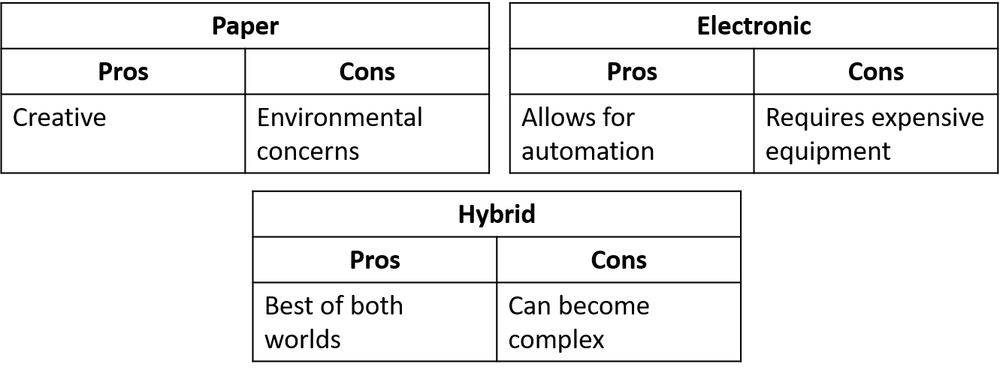

This is the second in a series about the joys and challenges of remote work. Having an organization system that allows you to compartmentalize your time is absolutely crucial to successful remote work. It is too easy to allow the ease of getting into and out of work mode to destroy your work-life balance, and this can ultimately blow away most of the benefits of remote work.

 on [Unsplash](https://unsplash.com/s/photos/planner-coffee?utm_source=unsplash&amp;utm_medium=referral&amp;utm_content=creditCopyText)")

## Finding your System
Having an organizational system that fits seamlessly into your life is a powerful thing. It can be a game-changer in taking time back, being a better worker, and being a better relaxer. But we want to avoid falling into the trap of making our organization system so convoluted that we end up spending more time than we can spare simply exercising it. Finding the right system is all about research and experimentation. If you’re here, you’ve already started your research, but look to the bottom of the page for some of my favorite time organizers because if my method doesn’t work for you, one of theirs might.

> Good experimentation is all about good documentation.

Good experimentation is all about documentation. Put your system into action-driven words; create steps for yourself. Each time you try a new system or tweak your current one, write that down. Then write down what worked and what didn’t. Even go as far as creating a Pro/Con list for your system, and then treat the Cons as goals. Every so often, audit your Cons. If you can think of a simple solution to one or two of them, implement it. And if your system has more or bigger Cons than Pros, take that as a cue to pivot. Look in the appendix to see the actual documentation for my actual organization system.

Once you’ve written your organization documentation, immerse yourself in that plan. Make it a part of your daily routine, and take stock often. Ask yourself the following questions:
* Do I find that I’m saving time during my day?
* Do I enjoy exercising my system?
* Does exercising my system fit into my day well?
* Do I feel less stressed with this system in place?
If the answer to one or more of these questions is “no,” time to pivot.

## The Nitty Gritty
Most organization systems have two main parts: a work-intensive head and a long tail. This work-intensive head will typically be on a day when you’re not exercising the system as much and you’ll make all of your plans for the long tail, the days you’ll be using the decisions you made upfront. Choose a weekly or monthly day to do this work. I do all of my planning on Sundays, which means I pick all of my meals for the week (and create a shopping list), plan my workouts (even down to finding videos, if that’s my vibe), and choose what tasks to focus on for that week. I also do a calendar check, so I can create a task for preparing for any meetings I have during that week; sometimes, I’ll even create my meeting agendas on Sundays. And if I have an exam coming up in the next few weeks, I create a study plan for it. Lastly, if I have someone I’ve been meaning to have lunch or get coffee with, I’ll plan that with them on Sundays and make sure to build time into my calendar for it. To be broader, I define success for the upcoming week on Sunday, so I always know what I’m striving towards. This is where the better work-life balance gets generated; when you’ve defined success for the week or even for each day, you know exactly when to take a break.

Now, you have all of these action items, but where does it all go? That’s a choice you have to make: paper, electronic, or hybrid. I’ve tried them all and there are Pros and Cons to each.

These are the choices and combinations that you should try out in your experimentation. I use an approach that I would technically call hybrid but leans heavily towards the electronic side, as you’ll see in my documentation.
You also have to think about the context of your system, who else might be using it? For example, I’m home for the holidays, so I am meal planning for four people instead of just one. The first couple weeks, it was like pulling teeth to get my family to sit down and think about what we want to eat for the week, who will be at each meal, etc. but once they started seeing the stress it saved (not to mention the healthy meals we got to try instead of take-out), they leaned in.

## Miscellaneous tips
* When in doubt, keep it simple
* Choose a single source of truth that contains all of your information, then fan out from there (for me, it’s my Notion, except for my calendar, which is on Google Calendar)
* Pick a day each week where you do no work or planning, this can be a break day or a catch-up day; I believe this rule single-handedly keeps me from burning out
The most difficult part of having an organizational system is not conception, it is maintenance. Keeping up with an organization system creates time profit, not just free time. By putting time into your organization every day, you save more time for yourself later. Organization is not for the [instant gratification monkey but rather for the rational decision-maker](https://www.youtube.com/watch?v=arj7oStGLkU). So it is your job to, every morning, get up and choose to be organized. And soon, it’ll become a habit!

***
# Appendix
## Documentation
* Kanban board with a backlog of tasks and a place to put the ones to focus on for the week ahead
* A living document of my daily routines
* List of recipes for the upcoming week with a list of ingredients compiled into a shopping list (good candidate for automation that I have not taken up just yet; updated on Sundays)
* List of workouts for the upcoming week (updated on Sundays)
* All of the things above housed on Notion
* Updated Google Calendar
* Written weekly to-do list to keep by my computer
* Written meal list to keep in the kitchen

## Other Great Organizers
[Thomas Frank](https://www.youtube.com/user/electrickeye91), [Mariana’s Study Corner](https://www.youtube.com/channel/UCEHp_b02I0GvTYCBPX_0w1g), [AmandaRachLee](https://www.youtube.com/user/amandarachlee) for bullet journal content, [Caitlin's Corner](https://www.youtube.com/channel/UCSm9WJDmpZDM_m6YvkACuxg)